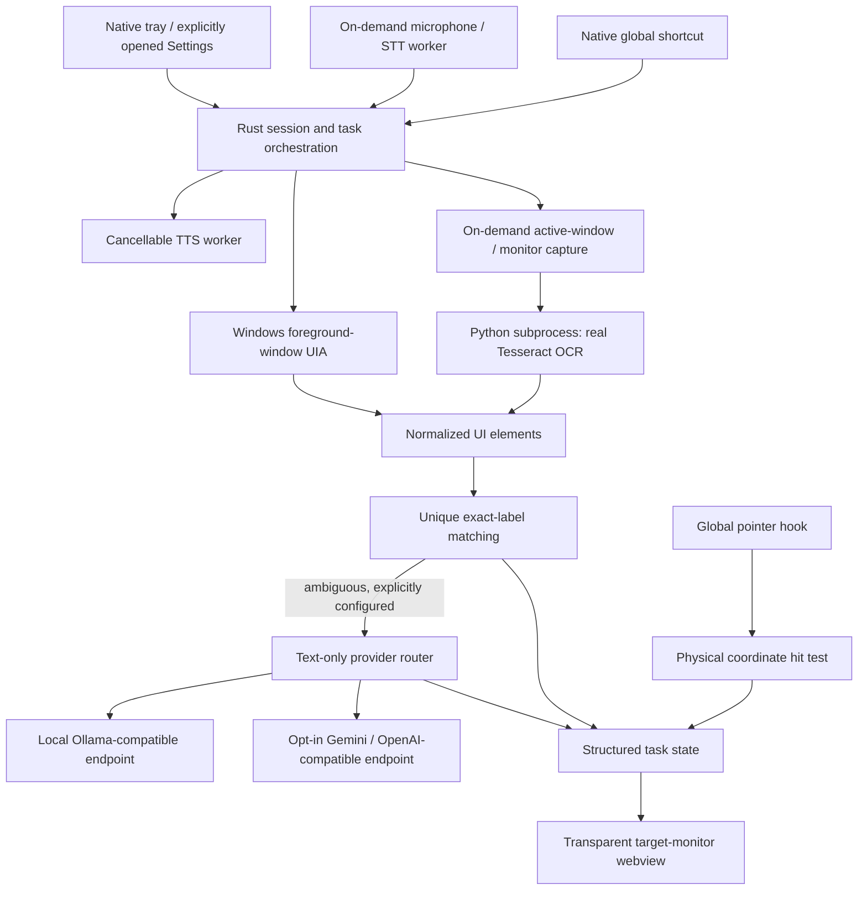

# ClickyAI architecture and implementation status

This document describes the implemented foundation, not completion of the product mission.
Windows is the primary target; Arch Linux is secondary. There is no mobile or macOS workstream.

## Audit (2026-09-27)

The original Phase 1 cursor companion used screen captures and Gemini. Commit `7be5940`
introduced spatial guidance; `9406bbe` replaced Gemini with Ollama and a Python parser.
The checked-out Phase 2 implementation still contained a mock parser, fake Linux target,
incorrect click verification, unresolved frontend npm imports, and an absent external binary.
The unused `windows_utils.rs`, highlight/viewfinder pages and template SVG assets were
Phase 1 leftovers and have been removed. `agylearn.md` is historical learning material.
The pre-existing Cargo.lock modifications were present before this work; dependency resolution
subsequently regenerated the lockfile while removing unused direct dependencies.

Baseline `cargo check` failed on the missing `omni_server-<target>` resource. There were no
tests. The original Python response used `box`, while Rust expected `box_coords`.
The original main window was entirely click-through with no usable request entry surface.

## Component / process model

Rust owns tasks, targets, configuration, cancellation, captures, subprocesses and network access.
All three webviews start hidden. Settings is secondary; a compact indicator shows active session status.
The overlay is click-through and non-focusable. Tray actions and native shortcuts control the session. Browser
code uses Tauri's injected API, with only relative ES module imports; no frontend bundler is
needed. CSP disallows remote scripts. No shell permissions are granted to either webview.

The OCR worker is a bundled Python script, not an HTTP service or prebuilt executable. One
request creates one process; EOF terminates input, output is bounded, Rust enforces a 20-second
timeout and kill-on-drop, and Python bounds Tesseract to 12 seconds. Failures are surfaced to
the task. Missing Python/OCR dependencies never yield synthetic elements. Frozen standalone
OCR packaging and process-tree cancellation still need work; a Tesseract grandchild can outlive
an abruptly terminated Python process briefly.

## Task and context flow

A central Rust session state machine owns the voice/visual lifecycle:

`IDLE -> ACTIVATING -> LISTENING -> TRANSCRIBING -> THINKING -> ANALYZING_SCREEN -> PLANNING -> GUIDING -> SPEAKING -> WAITING_FOR_USER -> VERIFYING -> next step / COMPLETED -> IDLE`.

Explicit transition validation, ERROR and PAUSED states avoid unrelated activity booleans. Alt+X
toggles activation/cancellation. Escape is registered only while active on Windows/X11. Cancellation
aborts the owned async job, kills the voice worker and hides both guidance and indicator.

Each task step has an ID, instruction, target hint, typed target, expected action, verification
condition, retry count and status. Explicit `then` sequences work deterministically. A configured
reasoning model can produce a validated plan of at most ten click steps, with a first target that
must exist uniquely in current perception. Future steps are grounded only when reached. Dragging,
typing and semantic tutorial outcomes remain unsupported. Once grounded, speech and overlay consume
one selected step whose instruction names the actual selected target.

Voice workers are on-demand subprocesses with bounded JSON-line output, timeouts and kill-on-drop.
Vosk loads before microphone capture; energy-based voice activity detection ends capture after
silence. Local Linux TTS uses eSpeak PCM in memory and chunked PortAudio output; Windows uses SAPI.
Cloud STT/TTS are optional separate providers with independent audio consent and HTTPS endpoints.
No microphone is opened by startup or diagnostics. A separate idle D-Bus worker receives Wayland
shortcut portal events; it does not capture audio or prompt for permission during startup.

Task IDs are monotonic within a process. At most 20 steps, 2,000 input bytes and four reasoning
selections are allowed per task. Recent conversation is never appended. Only the current
instruction and at most 100 element labels/roles/IDs enter a model prompt. Session preferences,
current task and short-lived perception/provider caches live in memory. Persistent preferences,
application context, richer plans and semantic history compaction remain future work.

## Perception and geometry

Windows searches enabled, visible, exact-name UIA matches inside the foreground application,
case-insensitively. Multiple matches are ambiguous. COM objects are scoped and released before
COM uninitialization; the BSTR variant is freed. Native calls run off the UI thread. A hung UIA
provider is not yet isolated in a killable process.

OCR uses real screenshot pixels, not mock coordinates. Windows captures the active window
clipped to its monitor. X11 uses the pointer monitor. Python limits image pixels, downscales to
1600×1200, converts to grayscale, groups recognized words into lines and maps bounds back to
capture pixels. Exact duplicate images/origins reuse the last OCR result. This is byte-level
deduplication; perceptual hashing and candidate-region recapture are not implemented.

Coordinates are global physical pixels in Rust. UIA, captured OCR bounds and pointer hit tests
share that space. At the overlay boundary, subtract the monitor origin then divide by that
monitor's scale. Windows uses the screenshot dependency's physical capture entry point to avoid
applying DPI twice. Tests cover negative origins and scale factors 1, 1.25, 1.5, 1.75 and 2.
Actual mixed-DPI monitor arrangements still require Windows hardware testing. A target spanning
monitors is displayed only on the monitor containing its center.

Global input remembers the last observed pointer position and requires it to be inside the
current target before advancing. No position means no success. A second click cannot advance a
step being grounded. This proves a geometric hit only: menus, outcomes, moved targets and stale
UI are **not** semantically verified. Semantic verification is a release blocker.

## Provider flow and limits

`Disabled`, `Local`, `OpenAiCompatible`, `Gemini` share a router and typed decision contract.
Default is Disabled (deterministic local guidance remains enabled). Endpoints and model names
are supplied by the user. Local endpoints must be loopback; cloud endpoints require HTTPS and
explicit consent. Redirects are disabled. Secrets come from `CLICKY_API_KEY`, never webview
storage. Gemini expects the full model-specific generateContent URL.

Responses must be a validated `highlight`, `ask_user` or bounded `plan` object. Unknown fields, invented IDs,
invalid confidence, overlong text and arbitrary prose are rejected. Ollama receives a JSON
schema; other providers request JSON mode and are validated locally with Serde plus semantic
checks. Full standards-based JSON Schema validation and schema repair are not implemented.

Requests have a 20-second timeout, at most three attempts, exponential backoff, bounded numeric
Retry-After handling, a 30-second circuit breaker, request serialization/deduplication, a
16,000-byte compact prompt bound and a 64-KiB transport / 8-KiB decision bound. Permanent 4xx
errors are not retried. Cancellation aborts the Rust task and drops outstanding HTTP futures.
Cloud/provider failure returns control to the user; deterministic local matching remains usable.
Automatic failover to a second configured model, exact token accounting and provider usage
telemetry are not implemented. The breaker currently covers the router, not individual endpoints.

## Platform capability matrix

| Capability | Windows 10/11 | Linux X11 | Native Wayland / Hyprland |
|---|---|---|---|
| Control window | Implemented; Windows runtime untested here | Implemented | Launched on this Arch/Hyprland host |
| Activation shortcut | Native plugin; hardware validation pending | Native plugin; desktop validation pending | XDG portal client implemented; consent/key activation unverified |
| Pointer/click observation | rdev native hook | rdev X11 hook | Disabled; no fabricated positions |
| Accessibility | Foreground UIA exact match | AT-SPI not integrated | AT-SPI not integrated |
| Local OCR capture | Active window / monitor | Pointer monitor | Portal capture not integrated |
| Spatial overlay | Implemented; hardware validation pending | Implemented; runtime validation pending | Guidance disabled; stacking/positioning unverified |
| Verification | Geometric hit | Geometric hit | Unavailable |

Diagnostics distinguish session type, desktop and Hyprland environment, input initialization
errors and these limitations. Environment detection is not proof a portal or accessibility
service is usable. Active portal probing, AT-SPI readiness, Hyprland cursor/window integration,
portal capture consent, compositor positioning and semantic verification are the next Linux
work. Forcing GDK to X11 does not turn a Wayland session into supported X11 desktop guidance.

## Privacy and observability

No cloud screenshots, no screenshots written to disk, no task history persisted. Cloud may
receive visible UI labels only after the checkbox is enabled. UI labels can still be sensitive.
The model is told to treat those labels as untrusted data. Logs contain event names, task IDs,
error classifications and elapsed timings, not prompts, screenshots or API keys. Pointer events
are sent only during active guidance, throttled to roughly 60 Hz; frontend drawing is animation
frame scheduled. There is no periodic AI, OCR or screenshot loop while idle.

Preferences currently last only for the process. Startup integration, advanced appearance,
redaction, diagnostic export, comprehensive phase timings and secure OS key storage are pending.

## Packaging and validation

`npm run tauri build` uses platform-specific bundle targets: NSIS on Windows, deb/rpm on Linux.
Python sources are bundled as `perception/main.py` and `voice/{worker,portal,local_tts}.py`. The current installer does not provision
Python, OCR/voice modules, Tesseract, eSpeak NG or the Vosk model. Those are documented runtime prerequisites;
UIA does not require them. Arch users can run the built binary with the development OCR path or
package the release resource layout. An Arch PKGBUILD and self-contained OCR packaging are pending.

CI validates Windows and Linux independently and uploads artifacts, without publishing releases.
It cannot prove global input, application compatibility or physical display geometry. Local Linux
builds do not constitute Windows build validation. Run `npm run validate` for focused automated
checks. See README for a manual demo and remaining acceptance gates.

## Implementation order from here

1. Complete startup/package testing on Windows and X11; validate native UIA, hooks and mixed DPI.
2. Semantic verification and stale-target invalidation; then demonstrate a real multi-step flow.
3. AT-SPI and local OCR readiness diagnostics, active-application context and adapters.
4. Killable native perception, standalone worker packaging and recovery tests.
5. Broader tutorial actions, provider fallback chains and measured task token budgets.
6. Wayland portal capture and Hyprland-aware guidance, with native action verification.
7. Persistent preferences, appearance controls, performance measurements and release signing.
